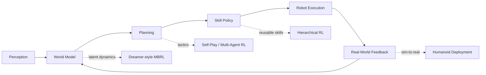

<div align="center">


<br />


<br />

<h1>
  <code>Even Wang</code>
</h1>

<p>
  <b>Algorithm Engineer · Robot Learning · Reinforcement Learning · World Models · Embodied AI</b>
</p>

<p>
  
  
  
</p>

</div>

---

<table>
<tr>
<td width="58%" valign="top">

## 🧬 Profile Kernel

```python
class EvenWangLab:
    identity = "Algorithm Engineer"
    domain = [
        "Embodied AI",
        "Robot Learning",
        "Reinforcement Learning",
        "World Models",
        "Humanoid Robot Control"
    ]

    current_stack = {
        "robotics": ["humanoid control", "robot soccer", "sim-to-real"],
        "rl": ["hierarchical RL", "self-play", "offline RL", "imitation learning"],
        "world_model": ["Dreamer", "latent dynamics", "video-enhanced RL"],
        "engineering": ["training pipeline", "simulation", "deployment interface"]
    }

    mission = (
        "Build embodied agents that can learn reusable skills, "
        "reason with world models, and transfer to real-world robots."
    )
```

</td>
<td width="42%" valign="top">

## ⚙️ Runtime Status

```text
[ research focus ]    Embodied Intelligence
[ active system  ]    Robot Soccer + World Models
[ main algorithm ]    RL / MBRL / IL / Self-Play
[ simulation     ]    Isaac Gym / Meta-World
[ deployment     ]    Sim-to-Real Robot Control
[ long horizon   ]    Generalizable Embodied Agents
```

<br />

<p align="center">
  
</p>

</td>
</tr>
</table>

---

## 🛰️ Research Navigation Map

<div align="center">



</div>

---

## 🧠 Research Modules

<table>
<tr>
<td width="50%" valign="top">

### ⚽ Module 01 — Robot Soccer / Humanoid RL

```text
repo        : BoosterGym
objective   : hierarchical robot soccer intelligence
architecture:
  ├── low-level control
  ├── mid-level skill policies
  └── high-level multi-agent tactics
```

**BoosterGym** is a hierarchical robot soccer research workspace for building humanoid control policies from locomotion to team-level tactics.

<a href="https://github.com/Wang-Even/BoosterGym">
  
</a>

</td>
<td width="50%" valign="top">

### 🌍 Module 02 — World Models

```text
repo        : World-Model-in-Metaworld
objective   : Dreamer-style model-based RL
environment : Meta-World manipulation tasks
core idea   : learn latent dynamics for planning
```

**World-Model-in-Metaworld** explores Dreamer-style world models for robotic manipulation and visual control environments.

<a href="https://github.com/Wang-Even/World-Model-in-Metaworld">
  
</a>

</td>
</tr>

<tr>
<td width="50%" valign="top">

### 🎥 Module 03 — Video-Enhanced Offline RL

```text
repo        : VeoRL
objective   : transfer prior knowledge from video
method      : model-based offline RL
domains     : manipulation / driving / open-world tasks
```

**VeoRL** studies how unlabeled video data can enhance offline reinforcement learning through world-model-based behavior guidance.

<a href="https://github.com/Wang-Even/VeoRL">
  
</a>

</td>
<td width="50%" valign="top">

### 📈 Module 04 — Applied ML System

```text
repo        : Exchange-Rate-Forecaster
objective   : multimodal time-series forecasting
model       : Transformer-LSTM
signals     : historical rate + market sentiment
```

**Exchange-Rate-Forecaster** is a deployable multimodal forecasting system that combines time-series modeling and sentiment-aware prediction.

<a href="https://github.com/Wang-Even/Exchange-Rate-Forecaster">
  
</a>

</td>
</tr>
</table>

---

## 🧩 System Architecture I Care About

<div align="center">

```text
┌──────────────────────┐
│   Simulation World   │
│ Isaac Gym / MetaWorld│
└──────────┬───────────┘
           │
           ▼
┌──────────────────────┐
│  Representation      │
│  Latent State Model  │
└──────────┬───────────┘
           │
           ▼
┌──────────────────────┐
│  Policy Learning     │
│  RL / IL / Self-Play │
└──────────┬───────────┘
           │
           ▼
┌──────────────────────┐
│  Skill Execution     │
│  Move / Pass / Trap  │
└──────────┬───────────┘
           │
           ▼
┌──────────────────────┐
│ Real Robot Interface │
│ Sim-to-Real Control  │
└──────────────────────┘
```

</div>

---

## 🛠️ Toolchain

<div align="center">


<br />
<br />


</div>

---

## 📡 Project Radar

| Signal                       | Project                                                                           | Role in My Research Map                                                                                 |
| ---------------------------- | --------------------------------------------------------------------------------- | ------------------------------------------------------------------------------------------------------- |
| ⚽ Robot Soccer / Humanoid RL | [BoosterGym](https://github.com/Wang-Even/BoosterGym)                             | Hierarchical robot soccer policy stack with low-level control, mid-level skills, and high-level tactics |
| 🌍 World Models              | [World-Model-in-Metaworld](https://github.com/Wang-Even/World-Model-in-Metaworld) | Dreamer-style world model experiments on Meta-World tasks                                               |
| 🎥 Offline RL                | [VeoRL](https://github.com/Wang-Even/VeoRL)                                       | Video-enhanced offline reinforcement learning reproduction and study                                    |
| 📈 Applied ML                | [Exchange-Rate-Forecaster](https://github.com/Wang-Even/Exchange-Rate-Forecaster) | Multimodal Transformer-LSTM exchange-rate forecasting system                                            |

---

## 📊 Dynamic Signals

<div align="center">


</div>

<br />

<div align="center">


</div>

---

## 🧭 Current Trajectory

```text
2026 focus:
  ├── Humanoid robot soccer with hierarchical policy learning
  ├── Mid-level reusable skill policies: chase / pass / trap
  ├── High-level tactics with imitation learning and self-play RL
  ├── Dreamer-style world models for visual control
  └── Video-enhanced offline RL for embodied agents
```

---

<div align="center">


<br />
<br />


</div>

